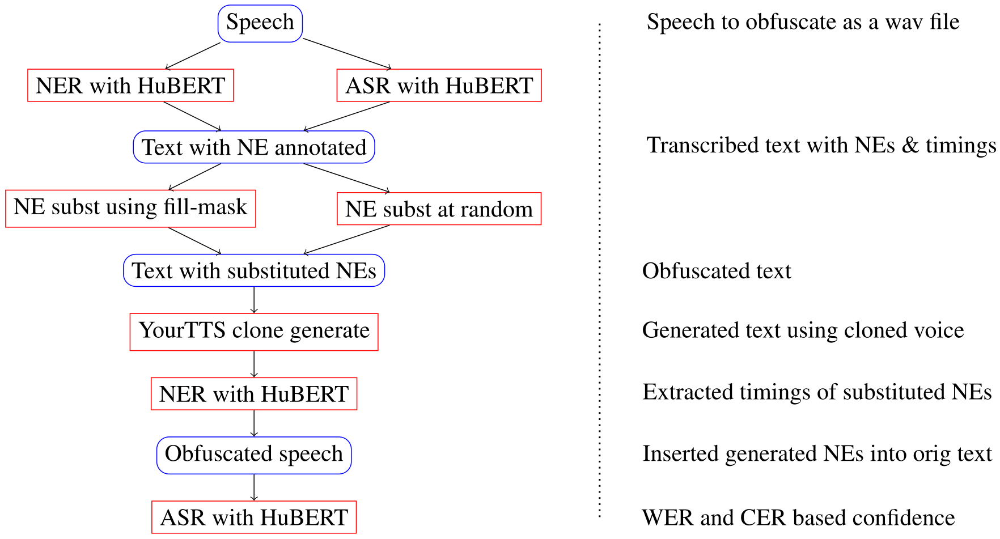

# Automatic Named Entity Obfuscation in Speech

This code accompanies the Findings of ACL 2023 [paper](https://aclanthology.org/2023.findings-acl.39), which implements the following pipeline:



If you use this code, please [cite](citing-the-paper) the associated paper.

## Requirements

This code has been developed and tested with `python 3.10`. The requirements can be installed into a virtual environment using

```
pip install -r requirements.txt
```

## Training separate NER and ASR models

Models can be trained for NER and ASR from [the English speech NER dataset](https://www.isca-speech.org/archive_v0/Interspeech_2020/pdfs/2482.pdf). In this work, this is done separately, although better performance could likely be achieved if this was done jointly. (Also, for ASR optimized fine-tuned models are available from Hugginfgace.)

```
usage: hubert_models.py [-h] --array_dir DIR_PATH --text_dir DIR_PATH --out_dir DIR_PATH [--model model] [--type type] [-n NUM_EPOCHS]
                        [-b BATCH_SIZE] [--train_proportion TRAIN_PROPORTION] [--val_proportion VAL_AND_TEST_PROPORTION]
                        [--random RANDOM_STATE]

Builds a HuBERT model for either transcripts or NER (depending on input) from the English speech NER dataset.

options:
  -h, --help            show this help message and exit
  --array_dir DIR_PATH  Path to the array directory
  --text_dir DIR_PATH   Path to the txt directory
  --out_dir DIR_PATH    Path to output directory
  --model model         Model to use
  --type type           Classification type: asr or ner
  -n NUM_EPOCHS, --num_epochs NUM_EPOCHS
                        Number of epochs
  -b BATCH_SIZE, --batch_size BATCH_SIZE
                        Batch size
  --train_proportion TRAIN_PROPORTION
                        Percentage of the data to be retained for training
  --val_proportion VAL_AND_TEST_PROPORTION
                        Percentage of the val/test portion of the data to be used for validation
  --random RANDOM_STATE
                        Default value of random state (for repeating experiments)
```

The work assumes that a directory, `array_dir`, containing the numpy arrays of signals exists (and that this contains each signal saved with a .txt.gz extension) and that there is a correspondingly named .txt file in `txt_dir`.

The models need to be accessible on the system for the obfuscation code to work.

## Generation of replacement named entity

A single wav file at a time can be passed to the `obfuscate_file.py` script, which uses the trained ASR and NER models, in combination with a masked languag emodel to select replacement(s) for person names found in the file. 

```
usage: obfuscate_file.py [-h] --asr_dir DIR --ner_dir DIR --input_wav FILEPATH [--masking_model MASKING_MODEL] --first_name_file FIRST_NAME_FILE --last_name_file
                         LAST_NAME_FILE [--top_k TOP_K] --reference_wav REFERENCE_WAV --output_wav OUTPUT_WAV

Obfuscation pipeline for speech inputs.

options:
  -h, --help            show this help message and exit
  --asr_dir DIR         Path to the ASR model.
  --ner_dir DIR         Path to the NER model.
  --input_wav FILEPATH  Path to the wav file to process.
  --masking_model MASKING_MODEL
                        Masking model to use for obfuscation (albert|bert|roberta).
  --first_name_file FIRST_NAME_FILE
                        Path to a file of first names, one name per line.
  --last_name_file LAST_NAME_FILE
                        Path to a file of last names, one name per line.
  --top_k TOP_K         Top number of masked model suggestions.
  --reference_wav REFERENCE_WAV
                        Path to reference wav.
  --output_wav OUTPUT_WAV
                        Path to obfuscated output wav.
```

For the generation portion, a `reference_wav` needs to be provided containing a larger sample of the speaker's speech - based on a few empirical experiments, around 4-5 minutes of speech produces very good results.

## Citing the paper

If you use the code, please cite the associated paper:

```
@inproceedings{Preiss:2023,
    title = "Automatic Named Entity Obfuscation in Speech",
    author = "Preiss, Judita",
    booktitle = "Findings of the Association for Computational Linguistics: ACL 2023",
    year = "2023",
    publisher = "Association for Computational Linguistics",
    url = "https://aclanthology.org/2023.findings-acl.39",
    pages = "615--622"
}
```